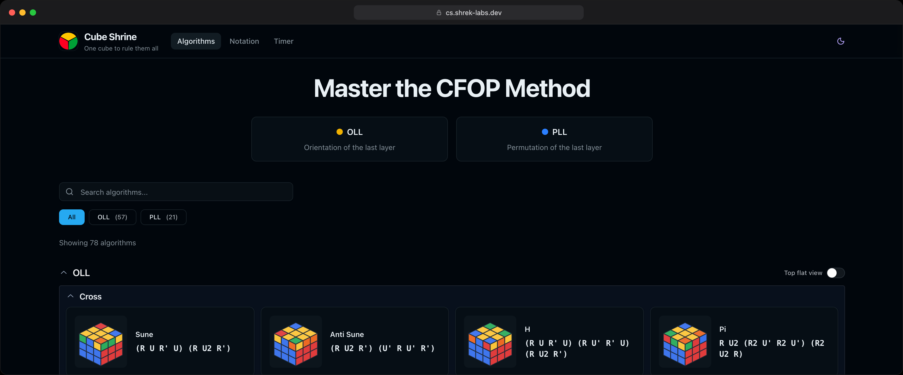

# Cube Shrine

[](https://github.com/ruminat/Cube-Shrine/actions/workflows/deploy-pages.yml?query=branch%3Amain) [](https://ruminat.github.io/Cube-Shrine/storybook/) [](https://ruminat.github.io/Cube-Shrine/)



Static [Next.js](https://nextjs.org/) app for browsing CFOP-style algorithms with **isometric cube previews** (Canvas 2D). TypeScript, SCSS modules, and [Radix Themes](https://www.radix-ui.com/themes) for layout and UI.

Cube modeling, notation parsing, canvas drawing, and optional React helpers live in the workspace package **`@shreklabs/cube-shrine`** (`packages/cube-shrine`), built with **Vite** and tested with **Vitest**.

## Repository layout

| Path | Description |
|------|-------------|
| `apps/web` | Next.js site (App Router, static export). |
| `packages/cube-shrine` | Library `@shreklabs/cube-shrine` — core logic, canvas render entry, React entry. |

The repo root is an **npm workspace** (`package.json` lists `apps/*` and `packages/*`). Install once from the root so the app links to the local package.

## Features

- **Algorithm gallery** grouped by category (`OLL`, `PLL`; `F2L` reserved for future data). OLL and PLL use **named subgroups** (shapes, perm types, etc.).
- **Per-card preview**: small cube drawn from parsed notation; **reverse notation** toggle, **copy**, and **open details**.
- **Modal** with description, notation, and a larger cube preview.
- **Theme**: light/dark toggle with `localStorage` and `data-theme` on `:root`.
- **Performance**: list cubes mount only when **near the viewport**; **small** cube canvases use **lower DPR** and **simpler fills**; one root observer drives palette updates (`CubePaletteProvider` from the library).

## Tech stack

- **Monorepo**: npm workspaces, `apps/web` + `packages/cube-shrine`
- **Site**: `next@16` (App Router, **`output: "export"`** for static hosting), `react@19`, `@radix-ui/themes`, `typescript`, `sass`
- **Library**: Vite (ESM library build), Vitest (Node test environment), [Storybook](https://storybook.js.org/) 8 (component / API demos in `packages/cube-shrine`)

## Getting started (full project)

From the **repository root**:

```bash
npm install
npm run dev
```

Opens the Next dev server (default [http://localhost:3000](http://localhost:3000)). This runs the **`web`** workspace only; the first `npm install` already links `@shreklabs/cube-shrine` from `packages/cube-shrine`.

**Production build** (library first, then static site):

```bash
npm run build
```

Static export is written to **`apps/web/out/`**. Serve that folder with any static host, for example:

```bash
npx serve apps/web/out
```

**Other root scripts**

```bash
npm run lint             # ESLint in apps/web + @shreklabs/cube-shrine
npm run test             # Vitest in apps/web + @shreklabs/cube-shrine
npm run typecheck        # tsc --noEmit in both workspaces (extend root tsconfig.json)
npm run codecheck        # typecheck + lint + test in both workspaces
npm run start            # next start in apps/web (after a production build)
npm run storybook        # Storybook for @shreklabs/cube-shrine (port 6006)
npm run build-storybook  # static Storybook → packages/cube-shrine/storybook-static/
```

`npm install` installs a **pre-commit** hook (via `simple-git-hooks`) that runs `npm run codecheck` when you commit on **`main`** or **`master`**.

**Regenerate the README screenshot** (framed capture of the live gallery, [Playwright](https://playwright.dev/)):

```bash
npm run screenshot -w web   # builds the static export, then writes apps/web/docs/screenshot.png
```

## Working on `@shreklabs/cube-shrine` independently

You can develop and validate the library without running Next.

```bash
cd packages/cube-shrine
npm install          # only needed if you open this folder alone, without a root install
npm run build        # Vite: emits dist/core.js, dist/render.js, dist/react.js, dist/index.js + .d.ts
npm run test         # vitest run
npx vitest           # watch mode while editing tests
```

### Storybook

Stories live under `packages/cube-shrine/stories/` and map package imports to **source** via `packages/cube-shrine/.storybook/main.ts` (Vite aliases), so you can iterate without rebuilding `dist/` first.

```bash
# from repo root
npm run storybook

# or from packages/cube-shrine
npm run storybook
```

Static bundle (e.g. for hosting docs):

```bash
npm run build-storybook
# output: packages/cube-shrine/storybook-static/
```

Included groups: **every atomic move** (grid), **OLL / PLL** views (OLL iso vs top-flat toggle; PLL matches the site’s top-flat + arrows), **vanilla canvas** (core + render only), and **notation utilities** (parse / invert / reversed steps).

### Publish `@shreklabs/cube-shrine` to npm

From `packages/cube-shrine`:

```bash
npm run release:pack     # verify package contents and dist output locally
npm run release:publish  # codecheck + build + npm publish
```

Manual flow (equivalent):

```bash
npm run prepublishOnly   # runs codecheck + build
npm publish --access public
```

Notes:

- The package publishes only `dist/` (`"files": ["dist"]` in `package.json`).
- You must be authenticated in npm (`npm login`) with rights for `@shreklabs`.

### Automated npm publish (GitHub Actions)

Use the manual workflow **`Publish @shreklabs/cube-shrine`** in GitHub Actions.

It will:

- bump `packages/cube-shrine/package.json` version automatically (from `bump` or explicit `version` input),
- run library checks/build (`prepublishOnly`),
- publish to npm with provenance,
- push the release commit and git tag,
- optionally create a GitHub Release for that tag.

Required repo secret:

- `NPM_TOKEN` (npm automation token with publish rights for `@shreklabs`).

## Using the library in other projects

Install from npm:

```bash
npm install @shreklabs/cube-shrine
```

Use the focused entrypoint you need:

```ts
// Node-safe core utilities
import { parseNotation, normalizeAlgorithm, validatePLLAlgorithm } from "@shreklabs/cube-shrine/core";

// Canvas rendering helpers
import { drawCube, getPaletteFromCSS } from "@shreklabs/cube-shrine/render";

// React components/hooks (optional)
import { MiniCube, useAlgorithmInput } from "@shreklabs/cube-shrine/react";
```

Minimal browser example (core + render):

```ts
import { createSolvedCubies, parseNotation, applyRotationStep } from "@shreklabs/cube-shrine/core";
import { drawCube } from "@shreklabs/cube-shrine/render";

const cubies = createSolvedCubies();
for (const step of parseNotation("R U R' U'")) {
  applyRotationStep(cubies, step);
}

const canvas = document.querySelector("canvas");
const ctx = canvas?.getContext("2d");
if (ctx) {
  drawCube(ctx, 220, cubies);
}
```

**Entry points** (import maps are defined in `packages/cube-shrine/package.json` under `"exports"`):

| Subpath | Use when |
|---------|----------|
| `@shreklabs/cube-shrine` | Default bundle: **core + render** (no React). |
| `@shreklabs/cube-shrine/core` | Cubie model, moves, notation parser, PLL/OLL pattern helpers — **Node-safe** (no `window` / canvas). |
| `@shreklabs/cube-shrine/render` | Canvas drawing (`drawCube`, palette from CSS, OLL/PLL flat views). Browser (or any environment with `CanvasRenderingContext2D`). |
| `@shreklabs/cube-shrine/react` | `MiniCube`, palette provider, `useCubeRenderer`, hooks. Requires **React** as a peer dependency. |

After changing library source, rebuild the package (or rely on `npm run build` from the repo root before `next build`). The web app lists `transpilePackages: ["@shreklabs/cube-shrine"]` so Next consumes the ESM output correctly.

## Styling and theming

Design tokens live in `apps/web/styles/variables.scss` (cube colors, size, surfaces, motion, etc.). Cube face colors are read at draw time from CSS variables such as `--cube-color-*`. Theme changes are observed in `CubePaletteProvider` (from `@shreklabs/cube-shrine/react`) and propagate to cube redraws.

## Cube rendering (library)

- **Model**: 27 cubies with stickers; preparation moves come from parsed notation (`@shreklabs/cube-shrine/core`).
- **`useCubeRenderer`** (`@shreklabs/cube-shrine/react`): creates a canvas, applies preparation rotations, exposes redraw/cleanup.
- **Size-based canvas quality**: below `CUBE_FULL_QUALITY_MIN_SIZE_PX` (from `@shreklabs/cube-shrine/render`), drawing uses preview DPR caps, compact sticker fills, and `pointer-events: none` on the mount for card thumbnails. Larger cubes use detail DPR caps and full gradients.
- **Viewport-aware mounting** — Cube canvases can render only when near the visible area (`MiniCube` + `useInViewport`).
- **Single palette observer** — Theme changes trigger redraws for visible cubes.

## Deployment

GitHub Actions (`.github/workflows/deploy-pages.yml`) runs `npm ci` and `npm run build`, then builds **Storybook** with a Pages-aware Vite `base` (`STORYBOOK_BASE_PATH`) and copies it to **`apps/web/out/storybook/`**, then uploads **`apps/web/out`** as the Pages artifact. With `GITHUB_ACTIONS=true`, `apps/web/next.config.mjs` sets `basePath` / `assetPrefix` for **GitHub Pages** project sites. User/org `*.github.io` repos skip the extra base path; Storybook is served from **`/storybook/`** on those repos.

## Data

Under **`apps/web`**:

- `data/oll.algs.ts`, `data/pll.algs.ts` — algorithm records.
- `data/algorithms.ts` — merged list, category order, and subgroup grouping helpers.

Extend types in `apps/web/types/algorithm.ts` and add sources the same way. PLL top-flat arrows are computed inside `getPllTopViewFromNotation` when the reversed prep is a valid PLL case (`AlgorithmCard` uses that model for previews).

## Conventions

See `.cursor/rules/project-conventions.mdc`.
